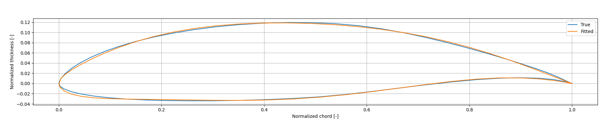
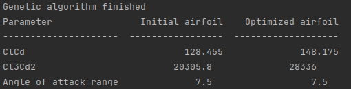
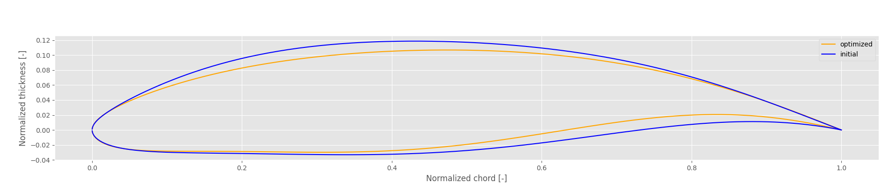

# Genetic-airfoil

Optimization of airfoil geometry for a high-altitude, long endurance (HALE) UAV.

### Includes 

* Python-Xfoil interface to generate airfoil polar using Xfoil viscous analysis mode.
* Conversion from PARSEC [1] parametrization to airfoil coordinates using a Chebychev grid.
* Conversion from airfoil coordinates to PARSEC parameters through non-linear fitting via SLSQP optimization.

* Optimization of airfoil geometry according to cost function f = 0.5*Cl3/Cd2 + 0.3*Cl/Cd + 0.2*alfa_range, where alfa_range is the range between the cruise angle of attack and the stall angle of attack. Done through a genetic algorithm formulation.

#### Comparison between initial parameters and optimized parameters

#### Original vs optimized airfoil geometry

### References
[1] R.W. Derksen, Tim Rogalsky, “Bezier-PARSEC: An optimized aerofoil parameterization for design”, Advances in Engineering Software 41 (2010) 923-930.
